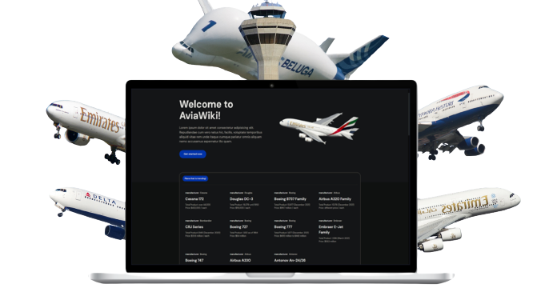

# Aviation Wiki - End of course project
#### A website by Dphong

### Mindx end of course project - Avation Wiki

# Preview about page

## Project Description
Welcome to AviaWiki - the website that provides information about flights around the world. With AviaWiki you can search for information about flights, planes, airlines and airports.

Our website provides detailed and accurate information about worldwide flights. You can view information about currently active flights, upcoming flights, as well as completed flights.

Our website also provides information on airlines and airports worldwide. You can search for information about airlines and airports, including information about addresses, phone numbers, websites and other utilities.

With worldwide flight tracking, you can keep track of the flights that interest you. You can enter information about your flight, and AviaWiki will provide departure time, arrival time, plane, airline and airport information, as well as status information. flight.

With AviaWiki, you will never miss any flights worldwide. You can search for information about your flight and other flights on our website, to ensure that you are always up to date with the latest information about your flight.

## How to run flight tracker

1- First you need to install [NodeJs](https://nodejs.org/en/)

2- Clone this repository, find file name "flight-tracker-reactjs", open the terminal / command prompt of that file, run:

### `npm install`

3- In the project directory, you can run:

### `npm start`

Runs the app in the development mode.\
Open [http://localhost:3000](http://localhost:3000) to view it in your browser.

The page will reload when you make changes.\
You may also see any lint errors in the console.

# what will be in the future
## you can read it too. 
### 1. [Flight Tracker API](https://airlabs.co/docs/flights)
### 2. [Flight Schedules API](https://dinhphongne.github.io/GameStation/)
### 3. [Flight Delay API ](https://airlabs.co/docs/delays)
### 4. [Flight Information API](https://airlabs.co/docs/flight)
### 5. [Flight Alert API ](https://airlabs.co/docs/alert)
### 6. [Airlines Database API](https://airlabs.co/docs/airlines)
### 7. [Airport Database API](https://airlabs.co/docs/airports)
### 8. [Airline Fleet Database API](https://airlabs.co/docs/fleets)
### 9. [Countries Database API](https://airlabs.co/docs/countries)
### 10. [Airline Routes DatabaseAPI](https://airlabs.co/docs/routes)

# who have helped me gradually improve the website
| Name/Web         | Description                                    |
| ---------------- | ---------------------------------------------- |
| Mr.Thang         | My IT Teacher                                  |
| Mr.Dominic       | My English Teacher                             |
| DucThien         | My friends, also a tester of my website        |
| NamPhong         | My friends, also a tester of my website        |
| NhaUyen          | My friends, also a tester of my website        |
| RapidApi         | Help me to find API that helpful               |
| Flight radar API | Provide the necessary APIs for me              |
| Airlabs website  | provide the necessary APIs for me              |
| Github           | Help me find some helpful code                 |
| uiverse.io       | Provide open-Source UI elements for my project |
| flight radar 24  | Help me understand how the site works          |

# CHANGELOG
## 6th May 2023
- Create project
- find some APIs on Rapidapi
- create assets file
- create logo 
- create website's name

## 7th May 2023
###### Create:
- index.html
- airline.html
- airport.html
- blog.html
- contact.html
- plane.html

###### create:
- css file
- js file

###### code:
- start code things in index.html and css for the page

## 8-14th May 2023
- Nothing new

## 14-20th May 2023
###### Code html and css:
- airline.html
- airport.html
- blog.html
- contact.html
- plane.html

## 21st May - 10th June 2023
- I spend time to rest and play game with friends:D

## 10th - 15th June 2023
- Turn to use OOP on header and footer

###### create:
- images file
- Json file

###### In file js:
- create header.js
- create footer.js
- spa.js

## 15th June - 20th June 2023
- change index.html
- create homepage.html
- create plane.js

## 20th June 2023 - 23rd June 2023
- create ticket-book.html
- create booking.css
- create booking.js

## 23rd June 2023 - 2nd July 2023
- create app.js, register.js, login.js
- coding register and login

## 2nd July 2023 - 25th July 2023
- fix some bugs
( I abandoned this project for 23 days because I learn ReactJS:D)

## 25th July 2023 - 30th July 2023
- use bootstrap for form in ticket-book.html
- create ticket array
- do powerpoint

# this is almost the last update for my end course project, but I will improve it in the future:D 
## Contact
You can contact me on facebook [Dinh Phong](https://www.facebook.com/profile.php?id=100026442681458).

